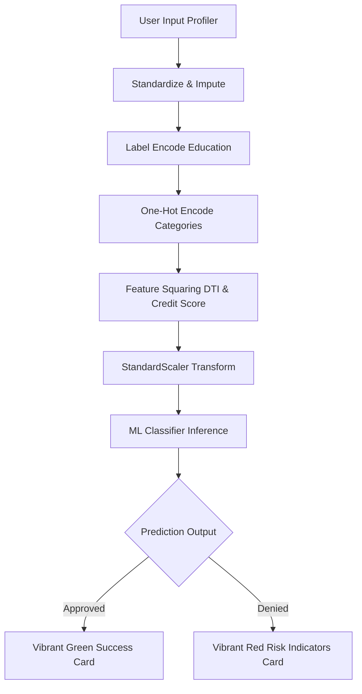

<div align="center">
  
  <h1>💳 CreditWise</h1>
  <h3>Intelligent Loan Approval & Risk Assessment System</h3>

  [](https://www.python.org/)
  [](https://streamlit.io/)
  [](https://scikit-learn.org/)
  [](https://plotly.com/)
  
  [](https://github.com/AnkitVishwakarma4591/CreditWise-Loan-Approval-System/stargazers)
  [](https://github.com/AnkitVishwakarma4591/CreditWise-Loan-Approval-System/network/members)
  [](https://github.com/AnkitVishwakarma4591/CreditWise-Loan-Approval-System/issues)
</div>

---

## 📖 Overview

**CreditWise** is a modern, end-to-end Machine Learning web application designed to evaluate loan applicants' creditworthiness. Using classifier algorithms trained on historical loan data, the system predicts whether a loan application should be approved or denied in real-time, displaying a dynamic risk assessment alongside key portfolio metrics and analytical charts.

---

## 🛠️ Tech Stack & Badges

<div align="left">
  
  
  
  
  
</div>

---

## 🚀 Key Features

*   **Multi-Model Predictions**: Toggle between **Logistic Regression**, **K-Nearest Neighbors (KNN)**, and **Naive Bayes** to see how different algorithms assess risk.
*   **Intelligent Profiler Form**: A responsive UI layout organizing demographic details, financial standing, and loan details with data-driven default limits.
*   **Probability Gauge**: Real-time evaluation results accompanied by a gauge chart displaying approval confidence percentage.
*   **Interactive Analytics Dashboard**: Live KPI cards representing historical portfolios (Total Applicants, Approval Rate, Averages) alongside 4 responsive visual charts:
    *   *Credit Score Distribution vs. Approval Status*
    *   *Debt-to-Income (DTI) Ratio vs. Approval Status Boxplots*
    *   *Loan Amount vs. Applicant Income Scatter Plots*
    *   *Inter-feature Correlation Heatmaps*
*   **Vibrant Dark Slate Theme**: Modern UI styling with deep radial glow gradients, glassmorphism, and responsive CSS animations.

---

## ⚙️ Data Preprocessing & Inference Flow

The pipeline handles imputation, target transformation, encoding, feature engineering, and scaling sequentially:



---

## 📸 Visual Tour

<div align="center">
  <h3>🔮 Loan Predictor & Risk Assessment View</h3>
  <p>A sleek form layout to profile applicant details, showing the dynamic approval prediction card and gauge meter.</p>
  
  
  <br/><br/>
  
  <h3>📊 Historical Portfolio Analytics</h3>
  <p>Key performance metrics (KPIs) and distributions showing historical loan approval characteristics.</p>
  
  
  <br/><br/>
  
  <h3>📈 Interactive Scatter Charts & Correlation Heatmaps</h3>
  <p>Interactive scatter charts comparing loans and incomes alongside feature correlation matrices.</p>
  
  
</div>

---

## 📈 Model Performance Comparison

The models are preprocessed with standardized imputations, label encoding, custom one-hot categorical vectors, and feature squaring (DTI & Credit Score) before standard scaling:

| Classifier Model | Accuracy | Precision | Recall | F1 Score |
| :--- | :---: | :---: | :---: | :---: |
| **Logistic Regression** (Best) | **87.50%** | **79.03%** | **80.33%** | **79.67%** |
| **Naive Bayes** | **86.50%** | **76.56%** | **80.33%** | **78.40%** |
| **K-Nearest Neighbors** (k=13) | **78.50%** | **67.65%** | **75.41%** | **71.32%** |

---

## 📂 Directory Structure

```text
CreditWise Loan Approval System/
├── .streamlit/
│   └── config.toml          # Custom dark slate application theme
├── assets/
│   ├── img 1.png            # Predictor screenshot
│   ├── img 2.png            # Analytics dashboard screenshot
│   ├── img 3.png            # Scatter plot screenshot
│   └── img 4.png            # Heatmap screenshot
├── models/
│   ├── num_imp.pkl          # Mean numeric imputer
│   ├── cat_imp.pkl          # Categorical imputer
│   ├── le_edu.pkl           # Label encoder for education level
│   ├── le_target.pkl        # Label encoder for target class
│   ├── ohe.pkl              # One-hot encoder
│   ├── scaler.pkl           # StandardScaler 
│   ├── log_model.pkl        # Logistic Regression model
│   ├── knn_model.pkl        # K-Nearest Neighbors model
│   ├── nb_model.pkl         # Naive Bayes model
│   └── metadata.json        # Preprocessing fields & training stats
├── app.py                   # Streamlit web application frontend
├── train_and_save.py        # ML training and asset serialization script
├── loan_approval_data.csv   # Historical loan portfolio dataset
├── requirements.txt         # Project package dependencies
└── README.md                # Project documentation
```

---

## 🛠️ Local Installation & Setup

Follow these steps to run the application locally on your machine:

### 1. Prerequisites
Ensure you have Python 3.9+ installed.

### 2. Clone and Navigate to the Directory
```bash
git clone https://github.com/AnkitVishwakarma4591/CreditWise-Loan-Approval-System.git
cd CreditWise-Loan-Approval-System
```

### 3. Install Dependencies
```bash
pip install -r requirements.txt
```

### 4. Train the Models
Generate the trained models and encoders from the dataset by executing:
```bash
python train_and_save.py
```

### 5. Launch the Streamlit App
Start the Streamlit GUI server:
```bash
streamlit run app.py
```
Open **[http://localhost:8501](http://localhost:8501)** in your browser to interact with the application!
